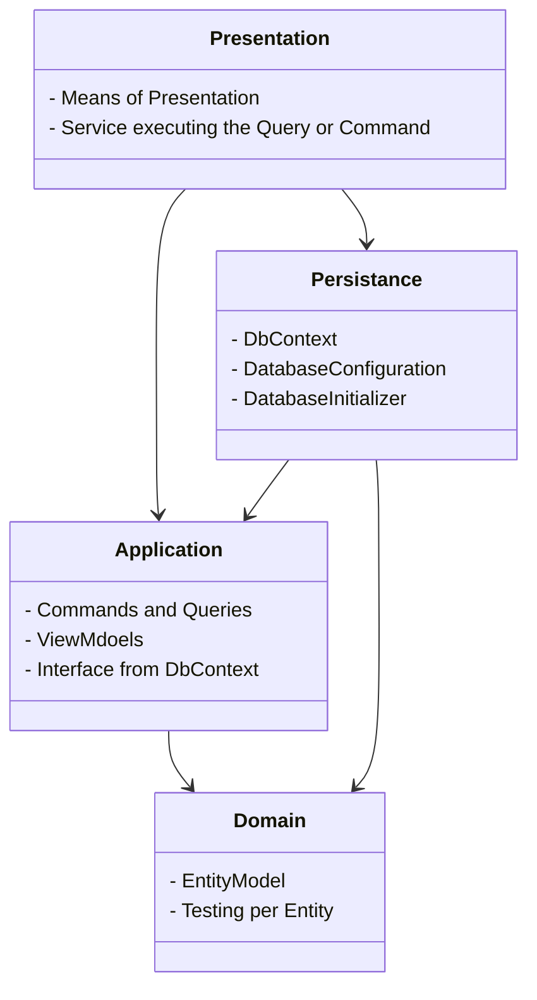

# Clean Architecture
To demonstrate the Clean Architecture, we've adapted one of our most common three layer projects. Here we pass data from the Data Access layer to the Presentation Layer.

## Solution Structure
The Clean Architecture differs from the Three Layer in the fact that is built around the core of the Domain and Application projects. An Data Access layer is created apart from the core, making it, via abstractions and the Inversion of Control Principle, interchangeable from the core. A traditional three layer would have to change with the core, to replace a database. Commands and Queries, following the CQRS Pattern, gather and send data to the Data Access layer.

In this example Persistence is the implementation of a Infrastructure project. Following the pattern of references, an other project referencing a outside source of data can be created.

